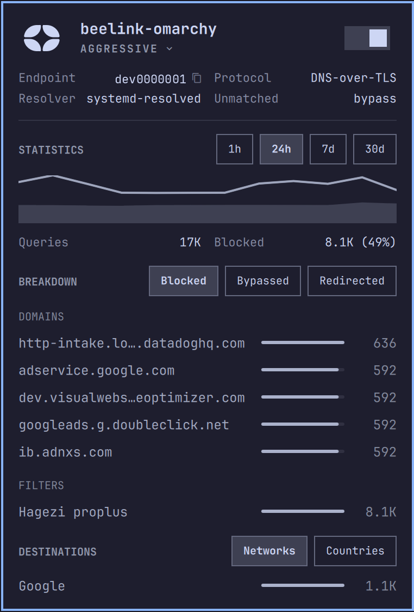
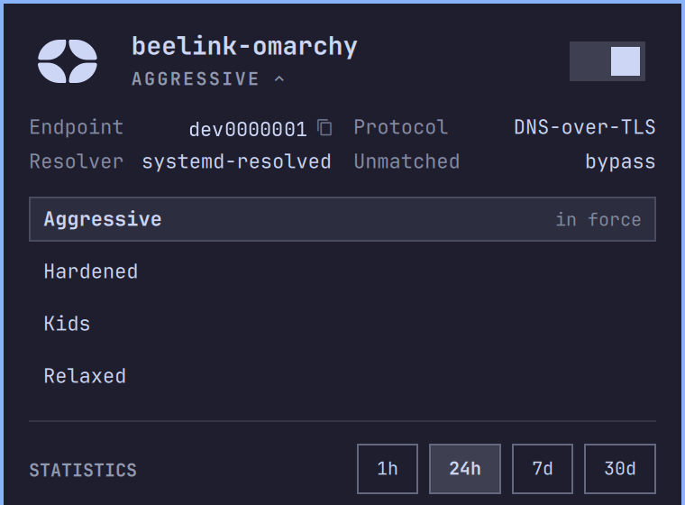
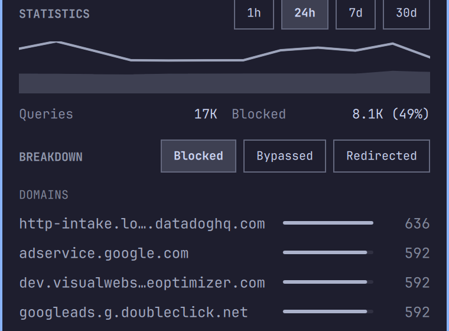
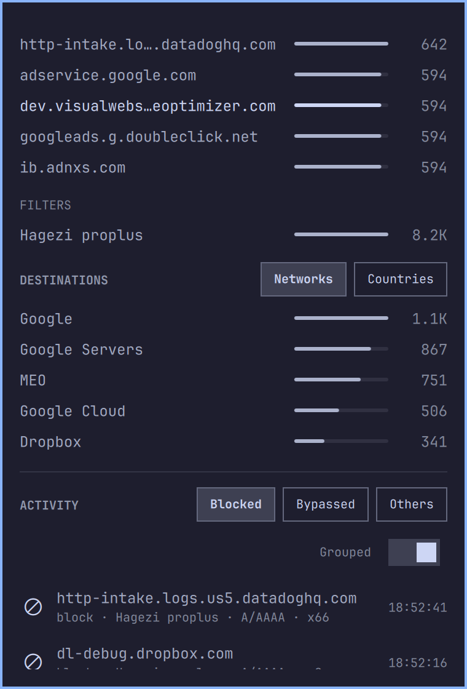
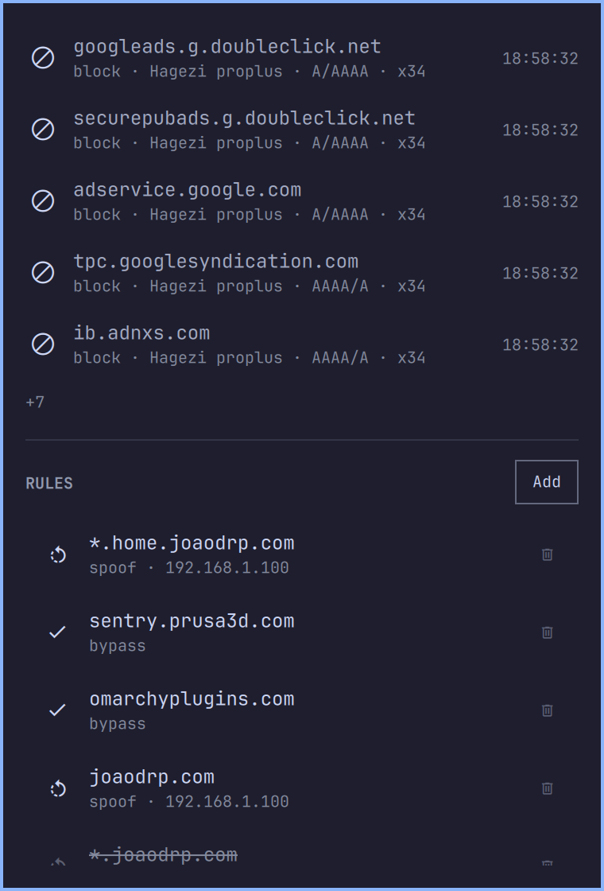
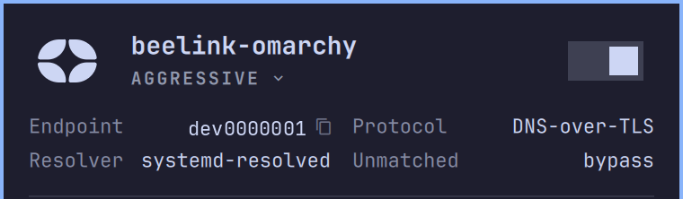
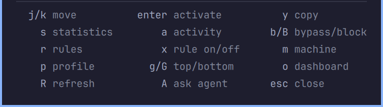

# Control D panel for Omarchy

See what [Control D](https://controld.com) is doing on **your machine**, from the Omarchy bar: the
endpoint you resolve through, the profile it enforces, and that profile's statistics, recent
lookups and rules. Block or bypass a host straight from the log.

Backed by [`cdctl`](https://github.com/joaodrp/controld-cli), an independent command-line
client for Control D.



The endpoint ID in these screenshots is a placeholder. A real one routes DNS, so publishing it
would let anyone resolve through that endpoint.

## Install

```sh
omarchy plugin add https://github.com/joaodrp/omarchy-controld-panel.git --enable
```

Needs `cdctl` installed and signed in (`cdctl auth login --token-stdin`). Full
[requirements](#requirements) below.

Move it to another section of the bar:

```sh
omarchy bar move io.github.joaodrp.controld --section right
```

## What it shows

Left click opens the panel, middle click refreshes. Every section needs an identified endpoint;
without one the panel shows only the reason -- no Control D resolver here, a resolver whose
endpoint is not in your account, or a failed device lookup.

| Area | Contents |
| --- | --- |
| Bar icon | Account state: dimmed when unavailable, badged when `cdctl` needs a login, crossed when `cdctl` is missing or nothing here is protected |
| Hero | Your endpoint and the profile it enforces, or the signed-in account when there is no endpoint; the mark opens the Control D dashboard, where everything the panel cannot do lives |
| MACHINE | Endpoint ID (click to copy), protocol, resolver, unmatched action; the resolver is probed locally, never taken from the account, so it names `ctrld` and its version whenever `ctrld` holds the endpoint |
| STATISTICS | Queries over time with the blocked share shaded under it, totals, and top domains, filters and destinations as meter rows; fetched only while the panel is open |
| ACTIVITY | Your most recent lookups, refreshed every 15s while the panel is open |
| RULES | The enforced profile's custom rules, root first then one group per folder, with action, spoof or redirect target, and disabled state |

It is mostly a reader. It writes three things, each through `cdctl`, which verifies the write by
reading the account back:

| Write | From |
| --- | --- |
| Custom rules: add, delete, switch off, override a lookup | Rules section, activity rows |
| The profile your endpoint enforces | Hero caret |
| Your device's on/off state | Hero switch |



### Statistics



Pick the window (1h/24h/7d/30d) and the verdict (blocked/bypassed/redirected); destinations switch
between networks and countries, spelled out from ISO 3166-1. The verdict governs domains and
filters, not destinations: a blocked query never reaches one, so destinations are the traffic that
was allowed. Domain rows copy the hostname; filter, network and country rows are inert, since
nothing takes those as input.

### Activity



- Filtered to **blocked** by default, the verdict worth acting on when a site fails to load.
  `Bypassed` and `Others` are the rest; `Others` is the only place a redirect or a spoof appears.
  Filtering happens server side, so a blocked list is a full list.
- `Grouped`, on by default, folds every row for a host into the newest with an `xN` tally, so a
  chatty telemetry endpoint cannot fill the section. Off keeps each lookup, in sequence.
- Bypass a blocked host, or block a bypassed one, from the row itself: the verdict glyph turns
  into the action on hover, `b` and `B` do the same from the keyboard. Pressing again removes the
  rule. The list is drawn short with a `+N` expander that costs no extra request.

### Rules



`Add` creates a rule, `x` switches the one under the cursor off without deleting it, delete sits
behind an inline confirmation, and `y` copies the hostname.

### Pause switch



The hero switch stands Control D down and brings it back.

- With `pauseCommand` and `resumeCommand` set, the panel runs those; empty, it pauses your device
  through the account instead, so the switch works with no setup. The two are not equivalent: a
  host command changes what your machine resolves through, the account changes what Control D does
  with what you ask of it. There is no one right host command -- `ctrld` has a service, a
  systemd-resolved setup has a drop-in -- so the panel runs what you give it.
- `statusCommand` answers whether it is on, inheriting any check the panel cannot make, such as a
  link carrying its own DNS. Without one the switch falls back to the identified device, or to
  Control D on the live resolver.
- Paused, the panel says so instead of reporting a missing resolver.

## Keyboard shortcuts

Press `?` in the panel for the same list:



| Key | Does |
| --- | --- |
| `?` | Show or hide the key legend |
| `o` | Open the Control D dashboard |
| `m` / `s` / `a` / `r` | Jump to machine, statistics, activity, rules |
| `g` / `G` | Jump to the top or the bottom |
| `j` / `k` or arrows | Move the cursor through every actionable row |
| `enter` / `space` | Activate the cursor row |
| `y` | Yank what the cursor is on, or the endpoint ID when it is on nothing |
| `p` | Open the profile picker |
| `b` / `B` | Bypass or block the host the cursor is on, or undo the rule for it |
| `x` | Switch the rule under the cursor on or off |
| `A` | Hand the panel to Omarchy's default agent, pointed at `cdctl` and the plugin rather than a dump of your account |
| `R` | Refresh (`r` names the rules section, so refresh takes the shift) |
| `esc` | Close |

## Settings

Set through the bar's widget settings, or inline on the widget's `shell.json` entry:

| Key | Default | Meaning |
| --- | --- | --- |
| `refreshIntervalSec` | `120` | Poll interval, 15-3600 seconds |
| `showStatistics` | `true` | Whether to query analytics at all |
| `showActivity` | `true` | Whether to poll the activity log while open |
| `activityRows` | `10` | Rows in the activity list before the expander, 3-20 |
| `statsWindowHours` | `24` | Statistics window the panel opens on, 1-720 hours |
| `statsRows` | `5` | Rows per statistics list: domains, filters, destinations, 3-20 |
| `ruleRows` | `15` | Rules shown before the list is cut, 5-100 |
| `statusCommand` | `""` | Command whose exit 0 means Control D is on; empty falls back to what the panel can see |
| `pauseCommand` | `""` | Command that stands Control D down; empty means no switch |
| `resumeCommand` | `""` | Command that brings it back; both must be set for the switch to appear |

## Will it find my setup?

The panel identifies your endpoint by reading the DNS config on the machine, so it works whether
Control D is held by `ctrld`, `stubby`, `dnscrypt-proxy`, `unbound`, `dnsmasq`, NetworkManager or
systemd-resolved -- including a plain IPv6 resolver with nothing in between.

If it finds a Control D resolver it cannot attribute, the resolver row reads `unknown` and links to
the issue tracker. **Please open an issue** so your setup can be added. Filtering on a router
or upstream is invisible from the machine, and no local probe changes that.

[How endpoint detection works](docs/how-it-works.md#endpoint-detection) has the details.

## Your API token

Statistics and activity come from an origin `cdctl` cannot reach, so two small Python helpers call
it directly. They read your token the same way `cdctl` does and send it in a request header only --
never a process argument, which is world readable on Linux, and never in output. Nothing is sent
anywhere but Control D.

[The full account](docs/how-it-works.md#the-two-origins) of what is called and how the token is
resolved.

## Requirements

- [`cdctl`](https://github.com/joaodrp/controld-cli), installed and authenticated. The panel
  looks on `PATH`, then in `~/.cargo/bin`,
  `~/.local/bin`, `/usr/local/bin`, `/usr/bin`
- `wl-copy` for clipboard actions
- `python3` for the analytics helpers, standard library only
- `omarchy-launch-browser` to open the dashboard, `omarchy-agent` for the `A` key. Both ship with
  Omarchy

The panel always passes `--profile <id>` explicitly, so `cdctl`'s `default_profile` need not be
set. Installed but not signed in, the panel shows what to do rather than an empty shell.

## Scripting

```sh
omarchy-shell io.github.joaodrp.controld toggle
omarchy-shell io.github.joaodrp.controld refresh
omarchy-shell io.github.joaodrp.controld profile   # enforced profile name
omarchy-shell io.github.joaodrp.controld status    # account line
```

## Contributing

Bug reports and pull requests welcome -- see [CONTRIBUTING.md](CONTRIBUTING.md) to get set up, and
[docs/how-it-works.md](docs/how-it-works.md) for how the pieces fit.

## Remove

```sh
omarchy plugin remove io.github.joaodrp.controld
```

## Icons

The bar and hero mark is the Control D logo, and the artwork belongs to Control D.

This is an independent project. It is not affiliated with, endorsed by, or supported by Control D.

## License

MIT, see [LICENSE](LICENSE).
