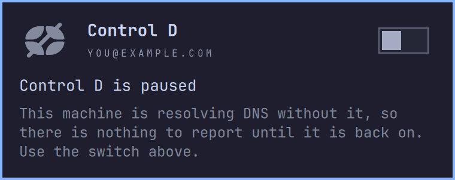

# Control D panel for Omarchy

[](https://github.com/joaodrp/omarchy-controld-panel/actions/workflows/ci.yml)
[](LICENSE)

See what [Control D](https://controld.com) is doing on **your machine**, from the Omarchy bar: the
endpoint you resolve through, the profile it enforces, and that profile's statistics, recent
lookups and rules. Block or bypass a host straight from the log.

Backed by [`cdctl`](https://github.com/joaodrp/controld-cli), an independent command-line
client for Control D.

> [!IMPORTANT]
> An independent project, not affiliated with Control D.


## Highlights

- 🚫 A site will not load? Find it in the log, press `b`, and it resolves.
- 🔀 Switch which profile your endpoint enforces without leaving the bar.
- ✍️ Add, switch off and delete custom rules in place.
- ⏸️ Stand Control D down and bring it back from the hero switch.
- 🔎 Identifies your endpoint from the resolver in use, not from the account: `ctrld`, `stubby`, `dnscrypt-proxy`, `unbound`, `dnsmasq`, NetworkManager, systemd-resolved, or a bare IPv6 address.
- 📊 Queries over time, the blocked share, and the domains and filters doing the blocking.
- ⌨️ Keyboard first: every actionable row has a key, and `?` shows them all.
- 🤖 Stuck? `A` hands the panel to Omarchy's agent to read your setup and fix it.
- 🔒 Writes go through `cdctl` and are read back to confirm. Your API token never touches a command line.

## Install

Needs [`cdctl`](https://github.com/joaodrp/controld-cli) installed and signed in
(`cdctl auth login --token-stdin`), plus the [requirements](#requirements) below.

```sh
omarchy plugin add https://github.com/joaodrp/omarchy-controld-panel.git --enable
```

## What it shows

Left click opens the panel, middle click refreshes.

Every section needs an identified endpoint. Without one the panel shows only the reason: no
Control D resolver here, an endpoint that is not in your account, or a failed device lookup.

| Area | Contents |
| --- | --- |
| Bar icon | Dimmed when unavailable, badged when `cdctl` needs a login, crossed when nothing here is protected |
| Hero | Your endpoint and its profile, or the account when there is no endpoint. The mark opens the dashboard |
| MACHINE | Endpoint ID (click to copy), protocol, resolver, unmatched action |
| STATISTICS | Queries over time, totals, and top domains, filters and destinations. Fetched only while the panel is open |
| ACTIVITY | Your most recent lookups, refreshed every 15s while the panel is open |
| RULES | The profile's custom rules, root first then one group per folder |

It writes in three places: the rules section and activity rows, the hero caret, and the hero
switch.

### Profile


The caret beside the profile name opens the list, and `p` does the same. The hero shows your
pick straight away, then settles on whatever the account confirms.

### Statistics


Pick the window (1h/24h/7d/30d) and the verdict; destinations switch between networks and
countries. The verdict governs domains and filters but not destinations, since a blocked query
never reaches one. Domain rows copy the hostname; the rest are inert.

### Activity


- Filtered to **blocked** by default; `Bypassed` and `Others` are the rest, and redirects and
  spoofs appear only under `Others`. Filtering is server side, so a blocked list is a full list.
- `Grouped`, on by default, folds a host's repeats into one row with an `xN` tally. Off keeps
  every lookup, in sequence.
- The verdict glyph becomes the action on hover, and `b` and `B` do the same from the keyboard.
  Pressing again removes the rule.

### Rules


`Add` creates a rule, `x` switches the one under the cursor off without deleting it, delete sits
behind an inline confirmation, and `y` copies the hostname.

### Pause switch



With `pauseCommand` and `resumeCommand` set, the panel runs those. Without them it stands your
device down through the account, so the switch works with no setup.

The two are not the same. A host command changes what your machine resolves through; the account
changes what Control D does with what you ask of it.

| Setting | Must |
| --- | --- |
| `statusCommand` | Exit 0 when Control D is on |
| `pauseCommand` | Stand it down, without waiting on a terminal |
| `resumeCommand` | Put it back |

The panel has no tty, so a command needing root must escalate itself with `pkexec` or a
passwordless `sudo` rule. One that waits for a password never returns.

For `ctrld`: `systemctl is-active --quiet ctrld`, `systemctl stop ctrld`, `systemctl start ctrld`.

systemd-resolved takes more care, since a link carrying its own DNS outranks the global endpoint.
[`dns-controld`](https://github.com/joaodrp/omarchy/blob/main/dot_local/bin/executable_dns-controld)
is a worked example.

## Keyboard shortcuts

Press `?` in the panel for the same list:


| Key | Does |
| --- | --- |
| `?` | Show or hide the key legend |
| `o` | Open the Control D dashboard |
| `m` / `s` / `a` / `r` | Jump to machine, statistics, activity, rules |
| `g` / `G` | Jump to the top or the bottom |
| `j` / `k` or arrows | Move the cursor through every actionable row |
| `enter` / `space` | Activate the cursor row |
| `y` | Yank what the cursor is on, or the endpoint ID when it is on nothing |
| `p` | Open the profile picker |
| `b` / `B` | Bypass or block the host the cursor is on, or undo the rule for it |
| `x` | Switch the rule under the cursor on or off |
| `A` | Hand the panel to Omarchy's default agent, pointed at `cdctl` and the plugin rather than a dump of your account |
| `R` | Refresh (`r` names the rules section, so refresh takes the shift) |
| `esc` | Close |

## Settings

Set through the bar's widget settings, or inline on the widget's `shell.json` entry:

| Key | Default | Meaning |
| --- | --- | --- |
| `refreshIntervalSec` | `120` | Poll interval, 15-3600 seconds |
| `showStatistics` | `true` | Whether to query analytics at all |
| `showActivity` | `true` | Whether to poll the activity log while open |
| `activityRows` | `10` | Rows in the activity list before the expander, 3-20 |
| `statsWindowHours` | `24` | Statistics window the panel opens on, 1-720 hours |
| `statsRows` | `5` | Rows per statistics list: domains, filters, destinations, 3-20 |
| `ruleRows` | `15` | Rules shown before the list is cut, 5-100 |
| `statusCommand` | `""` | Command whose exit 0 means Control D is on; empty falls back to what the panel can see |
| `pauseCommand` | `""` | Command that stands Control D down; empty means no switch |
| `resumeCommand` | `""` | Command that brings it back; both must be set for the switch to appear |

## Will it find my setup?

If the panel finds a Control D resolver it cannot attribute, the resolver row reads `unknown` and
links to the issue tracker. **Please open an issue** so your setup can be added. Filtering done on
a router or upstream is invisible from the machine, and no local probe changes that.

[How endpoint detection works](docs/how-it-works.md#endpoint-detection) lists what it reads.

## Your API token

Statistics and activity come from an origin `cdctl` cannot reach, so two small Python helpers call
it directly. They read your token the same way `cdctl` does and send it in a request header.

It never goes in a process argument, which is world readable on Linux, and never into the output.
Nothing goes anywhere but Control D.

[The full account](docs/how-it-works.md#the-two-origins) of what is called and how the token is
resolved.

## Requirements

[`cdctl`](https://github.com/joaodrp/controld-cli) is the only thing to install. The panel looks
for it on `PATH`, then in `~/.cargo/bin`, `~/.local/bin`, `/usr/local/bin` and `/usr/bin`.

Everything else already ships with Omarchy: `wl-copy` for clipboard actions, `python3` for the
analytics helpers (standard library only), `omarchy-launch-browser` for the dashboard, and
`omarchy-agent` for the `A` key.

The panel always passes `--profile <id>` explicitly, so `cdctl`'s `default_profile` need not be
set. Installed but not signed in, the panel shows what to do rather than an empty shell.

## Scripting

```sh
omarchy-shell io.github.joaodrp.controld toggle
omarchy-shell io.github.joaodrp.controld refresh
omarchy-shell io.github.joaodrp.controld profile   # enforced profile name
omarchy-shell io.github.joaodrp.controld status    # account line
```

## Contributing

Bug reports and pull requests welcome -- see [CONTRIBUTING.md](CONTRIBUTING.md) to get set up, and
[docs/how-it-works.md](docs/how-it-works.md) for how the pieces fit.

## Remove

```sh
omarchy plugin remove io.github.joaodrp.controld
```

## Trademarks

Control D and the Control D logo are trademarks of ControlD Inc. They appear here only to identify
the service this plugin works with. ControlD Inc does not sponsor or endorse this project.

The bar and hero mark is drawn from the Control D logo.

## License

MIT, see [LICENSE](LICENSE).

<sub>The endpoint ID and email address in the screenshots are placeholders.</sub>
